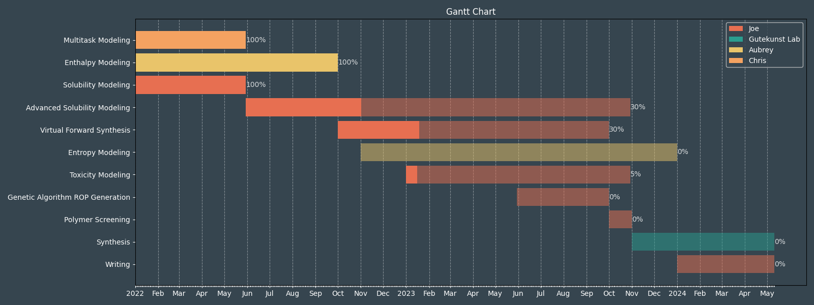

# Gantt Chart

Package the creates a gantt chart like that below

## Usage

1. Clone the package
2. Install the package using poetry and python version > 3.10
3. [Go into the data/proposal folder and change gantt\_chart.csv](/data/proposal/gantt_chart.csv)
and change the data to whatever you want (keep the columns though)
4. [Run the 'plot\_chart.py' file](/data/proposal/plot_chart.py)
